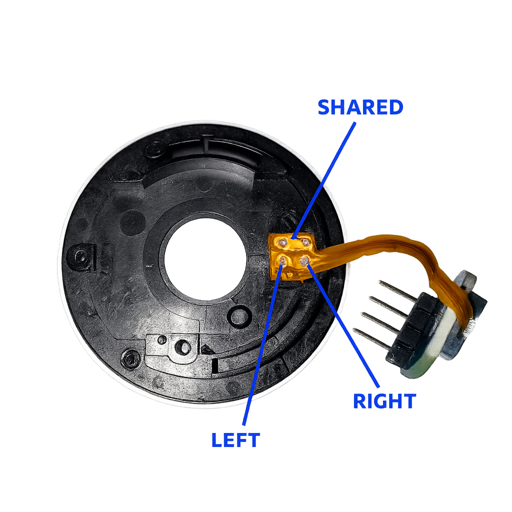

# Apple iSight Shutter / IR Sensor (Reverse‑Engineering Notes)

This document explains how the legacy Apple iSight’s internal shutter sensing assembly works, based on direct probing and measurement. Original documentation for this sub‑assembly appears to be unavailable publicly, so this is a practical guide for repurposing it.

If you want to view my original notes they're available as [raw_isight_notes.txt](raw_isight_notes.txt)

## What the Module Does

The original iSight has a physical privacy shutter. Inside the cylindrical enclosure there is an IR (infrared) emitter + phototransistor pair that detects whether the shutter is open (camera exposed) or closed (blocked).  

## Pin / Wire Summary

Observed connections (after removing / probing the iSight main board section):


| Pad    | Function (Repurposed Meaning)                                 | Notes                                                |
| ------ | ------------------------------------------------------------- | ---------------------------------------------------- |
| Shared | Internal +3.3 V distribution node                             | Feeds both IR LED and phototransistor collector      |
| Left   | IR LED side (through ~150 Ω resistor to GND)                  | Provides LED current path                            |
| Right  | Phototransistor output node (through ~5.6k Ω resistor to GND) | HIGH ≈ 3 V = shutter CLOSED; LOW ≈0 V = shutter OPEN |

## Measured Passive Elements

Two on‑board resistors:

- R2 ≈ 150 Ω (current limit for the IR LED path)
- R1 ≈ 5.7–5.9 kΩ

Measured resistances (summarized):
- Between `Right` and GND: ~5.8 kΩ (R1)
- Between `Left` and GND: ~150 Ω (R2)

## Voltage Behavior

Two operating states:

| State (Physical) | Right (to GND) | Interpretation |
| ---------------- | -------------- | -------------- |
| Shutter OPEN     | ~0.0 V         | Active LOW     |
| Shutter CLOSED   | ~2.9–3.0 V     | Pulled HIGH    |

Therefore:  
`RIGHT == HIGH` ⇒ Privacy engaged (shutter closed).  
`RIGHT == LOW`  ⇒ Camera exposed (shutter open).

## Reconstructed Functional Schematic

```
	  +3.3V (Power / Shared)
		   ├───────────────────────────────┐
		   │                               │
		   │                 (Phototransistor Collector)
	(IR LED Cathode)                       │
		   │                               │
		   │                               │
		   │                 (Phototransistor Emitter/Right)
	(IR LED Anode / Left)                  ├───────────────── -> OUTPUT
		   │                               │
		R2 ~150 Ω                       R1 ~5.8 kΩ
		   │                               │
		  GND                             GND
```

## Software Logic Pattern

```
loop:
    state = read_gpio()
    if state == HIGH and stream_active:
        pause_stream()        # shutter closed
    elif state == LOW and stream_paused:
        resume_stream()       # shutter open
    sleep(small_interval)
```

Use debounce of 10-20ms to ensure clean transition if you observe any jittering.

## Related Datasheets

[Sony D2450R](https://www.alldatasheet.net/datasheet-pdf/view/47003/SONY/CXD2450R.html)

## Disclaimer

“Apple” and “iSight” are trademarks of Apple Inc.; this project is unaffiliated.
